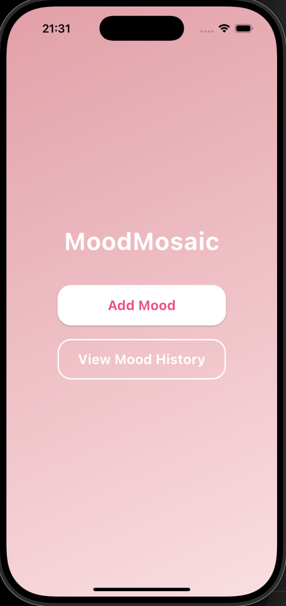
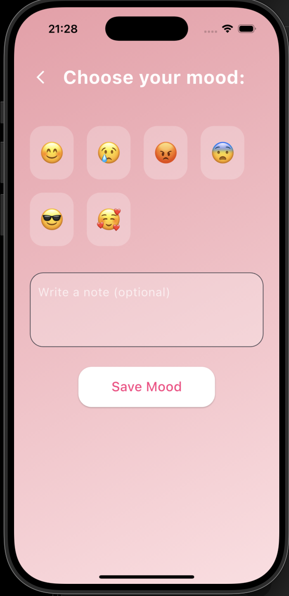
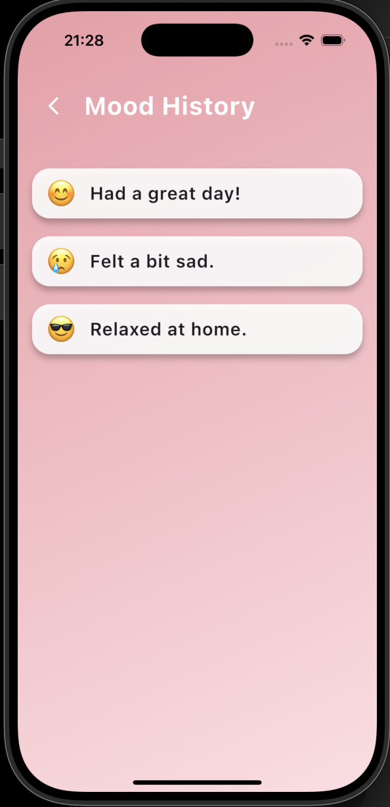

# 📱 Take-home Assignment
 
**Full Name : Moe Mya Myintzu**  

**Student ID : 6631503128** 

**App Name : Mood Mosaic**

**Framework Used : Flutter**

**GitHub Repository :** [https://github.com/moemyamyintzu3/moodmosaic_app.git](https://github.com/moemyamyintzu3/moodmosaic_app.git)

**Installation File (APK) :** [Download MoodMosaic APK](upload_apk/app-release.apk)

## 1. App Concept and Design

### 1.1 User Personas

**Persona 1**  
- **Name:** Thiri  
- **Age:** 20 years old 
- **Occupation:** 2nd year university student  
- **Needs:** Wants to track daily moods to better understand emotional patterns and improve personal mental health.

**Persona 2**  
- **Name:** Min 
- **Age:** 24 years old  
- **Occupation:** Internship student  
- **Needs:** Wants a simple and easy way to record feelings each day to relieve stress and reflect on personal growth.

---

### 1.2 App Goals

- Help users track their daily moods and emotions
- Support emotional awareness and mental health improvement
- Provide a simple and beautiful UI for easy mood recording and reflection

---

### 1.3 Mockups / Main Screens

1. **Home Screen** – displays app title and two main options: Add Mood and View Mood History  
2. **Add Mood Screen** – lets users select an emoji to represent their mood and write an optional note
3. **Mood History Screen** – shows a list of previously recorded moods along with user notes

## Home Screen

## Add Mood Screen

## Mood History Screen

---

### 1.4 User Flow

Open App → Home Screen → Tap "Add Mood" → Select Mood + (Optional) Write Note → Save → Mood appears in Mood History list

---

## 2. App Implementation

### 2.1 Development Details

**Tools & Tech Used:**
- Flutter 3.19
- Dart 3.2

---

### 2.2 Features Implemented

- [x] Create daily mood entries with emoji selection  
- [x] Navigate between Home, Add Mood, and Mood History screens 
- [x] Rounded buttons and soft shadows for modern visual experience   
- [ ] Mood analytics and chart visualization (planned for future version)
- [ ] Daily notification reminder to log mood

---

### 2.3 App Screenshots

## Home Screen

## Add Mood Screen

## Mood History Screen

---

## 3. Deployment

### 3.1 Build Type  
- [x] Debug  
- [ ] Release  

### 3.2 Platform Tested  
- [x] Android  
- [ ] iOS  

### 3.3 Installation Guide

1.Download .apk file
2.Open the file on Android device

---

## 4. Reflection

- Learned to design smooth and aesthetic UI using Flutter widgets
- Faced challenges managing navigation and page transitions by solving with clean routing
- Would love to add mood data saving, charts/analytics, and cloud sync features in the future

---

## 5. AI Assisted Development

### 5.1 Idea Generation 

- Prompt: “Suggest mobile app ideas for mood tracking and mental health support”
- Result: “Led to the concept of a simple mood tracker with emoji selection and optional notes”
---

### 5.2 UI Layout Prompt  
- Prompt: “How to create a beautiful gradient background and rounded button design in Flutter”
- Result: “Helped build a modern, aesthetic UI with smooth page transitions and soft colors”

---

### 5.3 Code Writing Prompt  
- Prompt: “navigate between multiple screens using Navigator”
- Result: “Used base navigation logic for moving between Home, Add Mood, and Mood History screens”

---

### 5.4 DDebug Prompt 
- Prompt: “failed to push due to unrelated histories and authentication issues”
- Result: “Identified pull strategies, merged local and remote branches successfully, and pushed code to GitHub”

---

### 5.5 Deployment Prompt 
- Prompt: “How to generate APK file in Flutter and install it manually on Android”
- Result: “Successfully built and tested the APK file on a real Android device”

---

## ✅ Final Checklist  
- [x] All sections completed  
- [x] GitHub repository created and push successful 
- [x] APK install file included  
- [x] Reflection and AI usage documented

